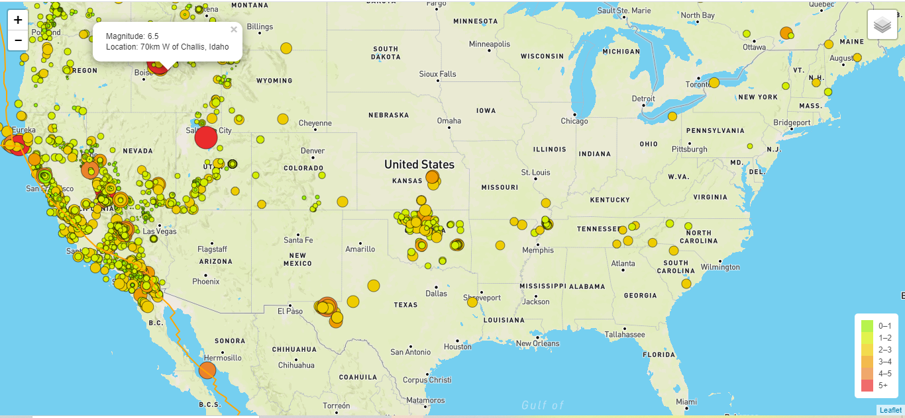
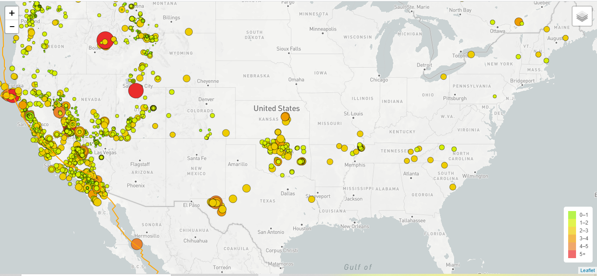
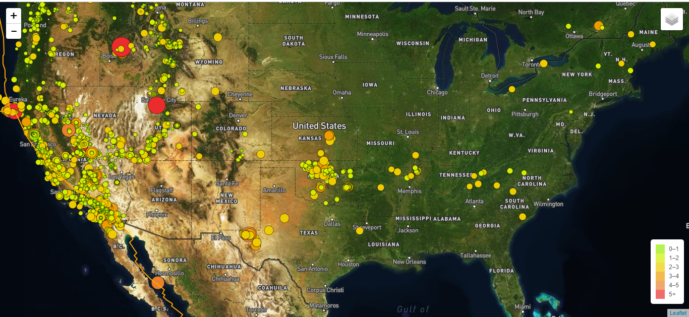

# Leaflet Homework - Visualizing Data with Leaflet

Visualized earthquakes occurring globally using a live API feed provided by the USGS(United States Geological Survey), and also included an additional layer of tectonic plates to understand the relationship between tectonic plates and seismic activites.

## Web application is deployed at the following link:

https://vpinnika.github.io/leaflet-challenge/.

## Technology stack used in developing this web application is as follows:
leaflet.js

HTML/CSS/Bootstrap/Javascript

GeoJSON

## Data Sources used :
https://earthquake.usgs.gov/earthquakes/feed/v1.0/geojson.php
https://raw.githubusercontent.com/fraxen/tectonicplates/master/GeoJSON/PB2002_boundaries.json

## Images

